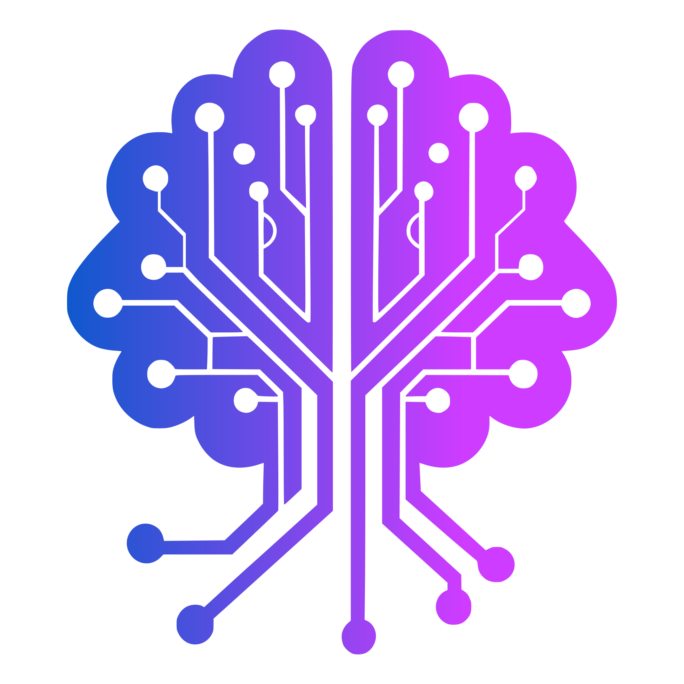

<p align="center">
  
</p>

<h1 align="center">TheraGPT</h1>

<p align="center">
  <strong>AI-powered Cognitive Behavioral Therapy journal for mental well-being</strong>
</p>

<p align="center">
  <a href="#features">Features</a> •
  <a href="#demo">Demo</a> •
  <a href="#getting-started">Getting Started</a> •
  <a href="#architecture">Architecture</a> •
  <a href="#usage">Usage</a> •
  <a href="#contributing">Contributing</a> •
  <a href="#faq">FAQ</a> •
  <a href="#license">License</a>
</p>

## 🌟 Overview

TheraGPT is an AI-powered Cognitive Behavioral Therapy (CBT) journal designed to help users identify, analyze, and reframe troubling thoughts and feelings. By leveraging AI technology, TheraGPT diagnoses cognitive distortions present in your thoughts and provides personalized strategies to mitigate them in the future.

Currently available as a web application at [theragpt.ai](https://theragpt.ai), TheraGPT offers a safe, private space to process difficult emotions and develop healthier thinking patterns through evidence-based CBT techniques.

<p align="center">
  
</p>

## ✨ Features

### Core Experience

- **AI Thought Analysis**: Submit troubling thoughts and receive AI-powered analysis
- **Cognitive Distortion Identification**: Automatically identify cognitive distortions in your thinking
- **Personalized Reframing**: Get tailored suggestions to reframe negative thought patterns
- **Journal History**: Track your progress and review past entries

### CBT Techniques

- **Thought Challenging**: Question and examine the evidence behind negative thoughts
- **Cognitive Restructuring**: Learn to replace distorted thoughts with more balanced ones
- **Pattern Recognition**: Identify recurring thought patterns and triggers
- **Coping Strategies**: Discover personalized techniques to manage difficult emotions

### Technical Features

- **Web-First Approach**: Optimized experience for desktop and mobile browsers
- **Privacy-Focused**: Your journal entries stay private and secure
- **Offline Support**: Continue journaling even without an internet connection
- **Mobile App (Coming Soon)**: Native mobile experience via React Native/Expo

## 🎬 Demo

Experience TheraGPT today at [theragpt.ai](https://theragpt.ai)

## 🚀 Getting Started

### Prerequisites

- Node.js (v18 or later)
- PNPM (v8 or later)
- OpenAI API key (for AI features)

### Installation

1. **Clone the repository**

```bash
git clone https://github.com/yourusername/theragpt-app.git
cd theragpt-app
```

2. **Install dependencies**

```bash
pnpm install
```

3. **Set up environment variables**

Create a `.env` file in the `apps/web` directory with the following variables:

```
# Required for AI functionality
OPENAI_API_KEY=your_openai_api_key

# Optional analytics
POSTHOG_API_KEY=your_posthog_key
POSTHOG_HOST=your_posthog_host
```

4. **Start the development server**

```bash
cd apps/web
pnpm dev
```

5. **Open your browser**

Navigate to `http://localhost:3000` to see the app running locally.

## 🏗️ Architecture

TheraGPT follows a monorepo architecture using Turborepo and PNPM workspaces:

```
theragpt-app/
├── apps/
│   ├── mobile/     # Expo mobile app (in development)
│   └── web/        # Next.js web app (current focus)
└── packages/
    ├── config/     # Shared configuration
    ├── llm/        # LLM integration utilities
    ├── logic/      # Core business logic
    └── prompts/    # AI prompt templates
```

### Tech Stack

- **Frontend**: Next.js with Tailwind CSS
- **State Management**: Zustand
- **AI Integration**: OpenAI API
- **Analytics**: PostHog (optional)
- **Storage**: Supabase (optional), Local Storage/ASyncStorage (default)
- **Package Manager**: PNPM
- **Monorepo**: Turborepo
- **Mobile (Planned)**: Expo (React Native)

## 📱 Usage

### Analyzing a Troubling Thought

1. Navigate to the journal entry page
2. Enter your troubling thought or feeling
3. Submit for AI analysis
4. Review the identified cognitive distortions
5. Explore suggested reframing strategies
6. Save the entry to your journal

### Reviewing Past Entries

1. Go to the journal history page
2. Browse through your past entries
3. Filter by date, distortion types, or keywords
4. Track your progress over time

### Using Thought Starters

If you're having trouble articulating your thoughts:

1. Click on "Thought Starters"
2. Select a prompt that resonates with your current state
3. Use it as a starting point for your journal entry

## 🤝 Contributing

We welcome contributions from the community! Here's how you can help:

### Development Workflow

1. Fork the repository
2. Create a new branch for your feature:
   ```bash
   git checkout -b feature/your-feature-name
   ```
3. Make your changes
4. Run tests:
   ```bash
   pnpm test
   ```
5. Submit a pull request

### Contribution Guidelines

- Follow the existing code style and conventions
- Write tests for new features
- Update documentation as needed
- Respect the code of conduct

For more detailed information, see our [Contributing Guide](CONTRIBUTING.md).

## ❓ FAQ

### Is my data private?

Yes! Your journal entries and thought analyses are private by default. We do not share your data with third parties, and all data is stored locally on your device unless you opt-in to persistent storage via Supabase.

### Is TheraGPT free to use?

TheraGPT is currently free to use. In the future, we may introduce a subscription tier for AI usage after a certain amount of daily queries to cover API costs. However, the source code will always remain open, allowing you to self-host the application.

### Can I use TheraGPT without a user account?

Yes! You can use TheraGPT without creating an account. All of your historical journal entries will be stored locally on your device. However, you can store your journal entries in our cloud database if you'd prefer by creating a user account.

### Can TheraGPT replace professional therapy?

No. TheraGPT is designed as a supplementary tool to help practice CBT techniques, but it is not a replacement for professional mental health care. If you're experiencing severe distress, please consult with a licensed therapist or counselor.

### How accurate is the AI analysis?

While our AI models are trained on CBT principles and cognitive distortion patterns, they are not perfect. The analysis should be viewed as a helpful starting point for reflection rather than a definitive diagnosis.

### When will the mobile app be available?

We're actively working on the mobile version of TheraGPT using Expo/React Native. Stay tuned for updates on our release timeline.

## 📄 License

TheraGPT is licensed under the [MIT License](LICENSE).

```
MIT License

Copyright (c) 2025 TheraGPT

Permission is hereby granted, free of charge, to any person obtaining a copy
of this software and associated documentation files (the "Software"), to deal
in the Software without restriction, including without limitation the rights
to use, copy, modify, merge, publish, distribute, sublicense, and/or sell
copies of the Software, and to permit persons to whom the Software is
furnished to do so, subject to the following conditions:

The above copyright notice and this permission notice shall be included in all
copies or substantial portions of the Software.
```

## 🙏 Acknowledgments

- [OpenAI](https://openai.com/) for their API that powers our AI-assisted features
- [Next.js](https://nextjs.org/) for their excellent framework

---

<p align="center">
  Made with ❤️ by <a href="https://x.com/SeanOliver">Sean Oliver</a> for mental well-being
</p>
