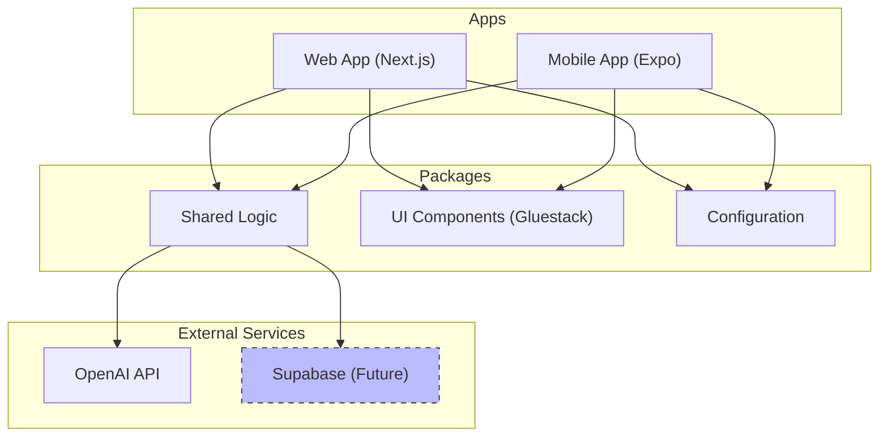
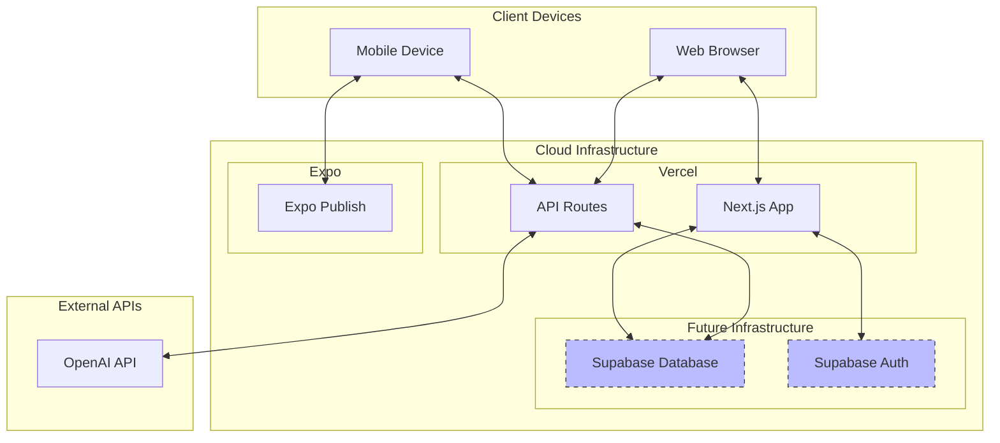
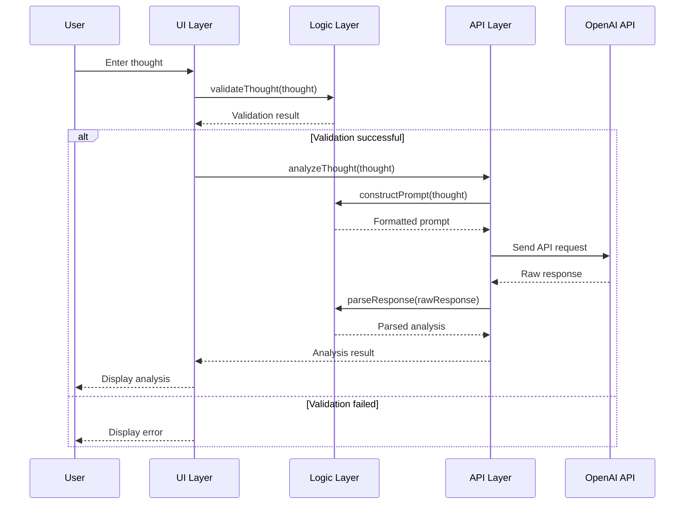
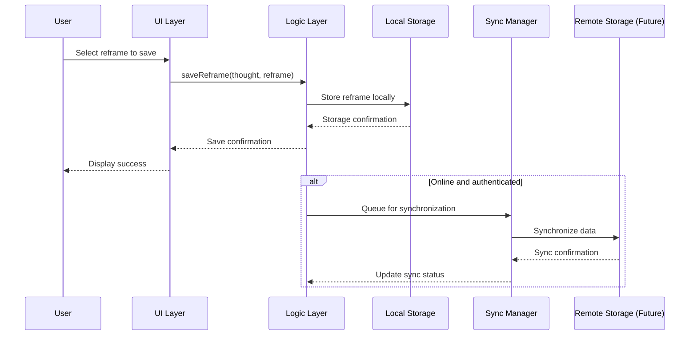
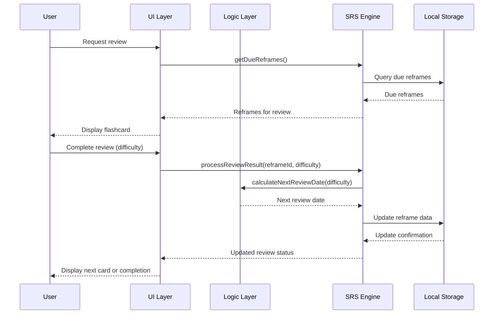
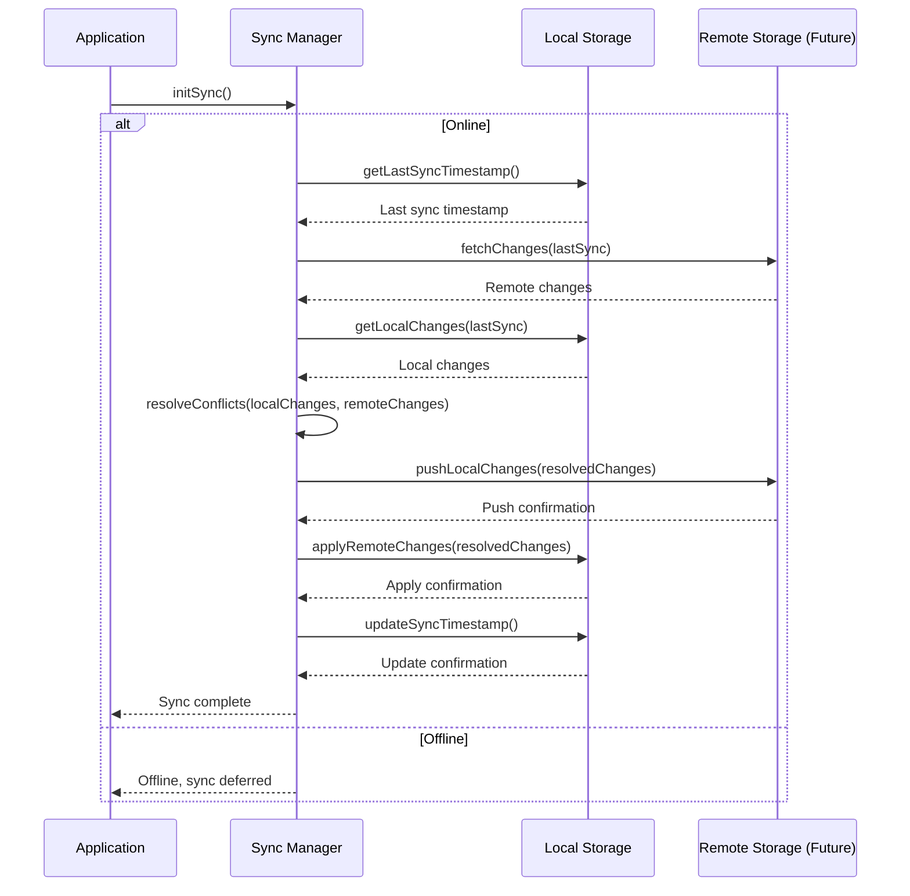

# Northstar Architecture Design

## Table of Contents
1. [System Architecture](#system-architecture)
   - [Overview](#overview)
   - [Component Diagram](#component-diagram)
   - [Deployment Architecture](#deployment-architecture)
2. [Service Boundaries and Responsibilities](#service-boundaries-and-responsibilities)
   - [Web Application](#web-application)
   - [Mobile Application](#mobile-application)
   - [Shared Logic Package](#shared-logic-package)
   - [UI Component Package](#ui-component-package)
   - [Configuration Package](#configuration-package)
   - [API Integration](#api-integration)
3. [Data Flow](#data-flow)
   - [Thought Analysis Flow](#thought-analysis-flow)
   - [Reframe Storage Flow](#reframe-storage-flow)
   - [SRS Review Flow](#srs-review-flow) (Future Consideration)
   - [Synchronization Flow](#synchronization-flow)
4. [State Management](#state-management)
   - [Client-Side State](#client-side-state)
   - [Server-Side State](#server-side-state)
   - [Persistence Strategy](#persistence-strategy)
5. [API Contracts](#api-contracts)
   - [Internal API Contracts](#internal-api-contracts)
   - [External API Contracts](#external-api-contracts)
6. [Technical Decisions](#technical-decisions)
   - [Monorepo Structure](#monorepo-structure)
   - [Package Organization](#package-organization)
   - [Dependency Management](#dependency-management)
   - [Environment Configuration](#environment-configuration)
   - [Security Considerations](#security-considerations)
   - [Performance Optimizations](#performance-optimizations)
   - [Scalability Approach](#scalability-approach)
7. [Implementation Roadmap](#implementation-roadmap)
   - [Phase 1: Foundation](#phase-1-foundation)
   - [Phase 2: Core Features](#phase-2-core-features)
   - [Phase 3: Enhanced Experience](#phase-3-enhanced-experience)
   - [Phase 4: Optimization](#phase-4-optimization)
   - [Phase 5: Future Extensions](#phase-5-future-extensions)

## System Architecture

### Overview

Northstar is a cross-platform mobile application designed to help users start each day with clarity and confidence through personal affirmations. The application will leverage AI to help users create and refine their affirmations.

The system follows a monorepo architecture with shared packages for logic, UI components, and configuration, supporting both web (Next.js) and mobile (Expo) platforms.

### Component Diagram



### Deployment Architecture



## Service Boundaries and Responsibilities

### Web Application

The Next.js web application serves as the primary web interface for Northstar, with the following responsibilities:

- Render user interface for thought entry, analysis, and review
- Handle client-side state management
- Implement API routes for server-side operations
- Manage authentication and user sessions (future)
- Provide responsive design for various screen sizes
- Implement web-specific optimizations and features

Key components:
- **Pages**: Implement the main application views (home, analysis, saved reframes, review)
- **API Routes**: Handle server-side operations like OpenAI API calls
- **Components**: Web-specific UI components that leverage shared UI package
- **Hooks**: Custom React hooks for state management and business logic

### Mobile Application

The Expo mobile application provides the native mobile experience for Northstar, with the following responsibilities:

- Implement native mobile UI for all application features
- Handle mobile-specific navigation
- Manage offline capabilities and synchronization
- Implement mobile-specific optimizations (battery usage, storage)
- Provide platform-specific features (notifications, gestures)

Key components:
- **Screens**: Implement the main application views for mobile
- **Navigation**: Handle mobile-specific navigation patterns
- **Services**: Mobile-specific services for native functionality
- **Hooks**: Custom React hooks for mobile state management

### Shared Logic Package

The shared logic package contains all business logic that is common between web and mobile platforms:

- Thought validation and processing
- OpenAI API integration and response parsing
- SRS algorithm implementation (future)
- Data synchronization logic
- Error handling and logging

Key modules:
- **ThoughtAnalyzer**: Validates and processes thoughts, integrates with OpenAI
- **ReframeManager**: Handles saving, retrieving, and managing reframes
- **SRSEngine**: Implements the spaced repetition algorithm
- **SyncManager**: Handles data synchronization between local and remote storage
- **ErrorHandler**: Centralized error handling and logging

### UI Component Package

The UI component package provides shared UI components using Gluestack that can be used across both web and mobile platforms:

- Basic UI elements (buttons, inputs, cards)
- Complex components (thought input, analysis result, flashcard)
- Theming and styling utilities
- Accessibility features

Key components:
- **ThoughtInput**: Component for entering thoughts with validation
- **AnalysisResult**: Component for displaying analysis results
- **Flashcard**: Component for SRS review
- **Theme**: Shared theming and styling

### Configuration Package

The configuration package manages shared configuration across all applications and packages:

- Environment-specific configuration
- Feature flags
- API endpoints and keys (securely managed)
- Constants and defaults

Key modules:
- **EnvironmentConfig**: Manages environment-specific configuration
- **FeatureFlags**: Controls feature availability
- **APIConfig**: Manages API endpoints and configuration
- **Constants**: Shared constants and defaults

### API Integration

The API integration layer handles communication with external services:

- OpenAI API for thought analysis
- Supabase for authentication and data storage (future)

Key responsibilities:
- Secure API key management
- Request formatting and response parsing
- Error handling and retry logic
- Rate limiting and caching

## Data Flow

### Thought Analysis Flow



### Reframe Storage Flow



### SRS Review Flow (Future Consideration)

*Note: SRS Review functionality is planned for future implementation and is not part of the initial development phases.*



### Synchronization Flow



## State Management

### Client-Side State

The application will use a combination of local component state and global state management:

- **Local Component State**: For UI-specific state that doesn't need to be shared
- **Global State**: For shared application state using React Context or a state management library

Key state categories:
- **User State**: Current user information and preferences
- **Thought State**: Current thought being analyzed and history
- **Analysis State**: Current analysis results and loading states
- **Reframe State**: Saved reframes and favorites
- **Review State**: Current review session and progress

### Server-Side State

Server-side state will be managed through:

- **API Routes**: For stateless server operations
- **Database** (future): For persistent user data and reframes
- **Caching**: For performance optimization of frequent operations

### Persistence Strategy

The application will implement a multi-layered persistence strategy:

1. **In-Memory State**: For active application state
2. **Local Storage**: For offline access and persistence between sessions
3. **Remote Storage** (future): For cross-device synchronization and backup

## API Contracts

### Internal API Contracts

#### Thought Analysis API

```typescript
// Request
interface AnalyzeThoughtRequest {
  thought: string;
  context?: string;
  userId?: string; // Optional, for authenticated users
}

// Response
interface AnalyzeThoughtResponse {
  originalThought: string;
  distortions: {
    name: string;
    explanation: string;
    confidence: number;
  }[];
  reframes: string[];
  explanation: string;
}
```

#### Reframe Management API

```typescript
// Save Reframe Request
interface SaveReframeRequest {
  originalThought: string;
  selectedReframe: string;
  userId?: string; // Optional, for authenticated users
}

// Save Reframe Response
interface SaveReframeResponse {
  id: string;
  success: boolean;
}

// Get Reframes Request
interface GetReframesRequest {
  userId?: string;
  limit?: number;
  offset?: number;
}

// Get Reframes Response
interface GetReframesResponse {
  reframes: Reframe[];
  total: number;
}
```

#### SRS Review API (Future Consideration)

```typescript
// Get Due Reframes Request
interface GetDueReframesRequest {
  userId?: string;
  limit?: number;
}

// Get Due Reframes Response
interface GetDueReframesResponse {
  reframes: Reframe[];
  total: number;
}

// Process Review Result Request
interface ProcessReviewResultRequest {
  reframeId: string;
  difficulty: 'easy' | 'medium' | 'hard';
  reviewedAt: number; // Timestamp
}

// Process Review Result Response
interface ProcessReviewResultResponse {
  success: boolean;
  nextReviewDate: number; // Timestamp
}
```

### External API Contracts

#### OpenAI API Integration

```typescript
// OpenAI Request
interface OpenAIRequest {
  model: string;
  messages: {
    role: 'system' | 'user' | 'assistant';
    content: string;
  }[];
  temperature: number;
}

// OpenAI Response (simplified)
interface OpenAIResponse {
  choices: {
    message: {
      content: string;
    };
  }[];
}
```

## Technical Decisions

### Monorepo Structure

The project will use a monorepo structure managed by Turborepo and PNPM workspaces. This approach offers several advantages:

- **Shared Code**: Easily share code between web and mobile applications
- **Consistent Versioning**: Ensure all packages are compatible
- **Simplified Dependency Management**: Manage dependencies from a single location
- **Coordinated Builds**: Optimize build processes with caching and parallelization
- **Atomic Changes**: Make changes across multiple packages in a single commit

The monorepo will be structured as follows:

```
theragpt-app/
├── apps/
│   ├── web/                 # Next.js web application
│   └── mobile/              # Expo mobile application
├── packages/
│   ├── logic/               # Shared business logic
│   ├── ui/                  # Shared UI components using Gluestack
│   └── config/              # Shared configuration
├── turbo.json               # Turborepo configuration
├── package.json             # Root package.json
└── pnpm-workspace.yaml      # PNPM workspace configuration
```

### Package Organization

The packages will be organized based on functionality and responsibility:

#### Logic Package

```
packages/logic/
├── src/
│   ├── thought/             # Thought validation and analysis
│   ├── reframe/             # Reframe management
│   ├── srs/                 # Spaced repetition system
│   ├── sync/                # Data synchronization
│   ├── api/                 # API integrations
│   └── utils/               # Utility functions
├── package.json
└── tsconfig.json
```

#### UI Package

```
packages/ui/
├── src/
│   ├── components/          # Shared UI components
│   │   ├── thought/         # Thought-related components
│   │   ├── analysis/        # Analysis-related components
│   │   ├── reframe/         # Reframe-related components
│   │   ├── review/          # Review-related components
│   │   └── common/          # Common UI components
│   ├── theme/               # Theming and styling
│   └── hooks/               # UI-related hooks
├── package.json
└── tsconfig.json
```

#### Config Package

```
packages/config/
├── src/
│   ├── environment.ts       # Environment configuration
│   ├── features.ts          # Feature flags
│   ├── api.ts               # API configuration
│   └── constants.ts         # Shared constants
├── package.json
└── tsconfig.json
```

### Dependency Management

The project will use PNPM for dependency management, with the following approach:

- **Root Dependencies**: Development tools and monorepo management
- **Shared Dependencies**: Common libraries used across multiple packages
- **Package-Specific Dependencies**: Libraries specific to each package

Key dependencies:

- **Core**: React, React Native, Next.js, Expo
- **UI**: Gluestack UI, React Native Web
- **State Management**: React Context, possibly Zustand for complex state
- **API**: Axios or fetch with custom wrappers
- **Testing**: Jest, React Testing Library
- **Build Tools**: TypeScript, ESLint, Prettier

### Environment Configuration

The project will use a secure, flexible environment configuration approach:

1. **Environment Variables**:
   - `.env.local` for local development (git-ignored)
   - `.env.example` with placeholders (committed to git)
   - Environment variables in deployment platforms (Vercel, Expo)

2. **Configuration Package**:
   - Centralized configuration management
   - Environment-specific settings
   - Type-safe configuration access

3. **Secret Management**:
   - API keys stored as environment variables
   - No hardcoded secrets in the codebase
   - Server-side only access to sensitive values

Example configuration module:

```typescript
// packages/config/src/environment.ts
import { z } from 'zod';

// Define environment schema
const envSchema = z.object({
  NODE_ENV: z.enum(['development', 'production', 'test']),
  OPENAI_API_URL: z.string().url(),
  // API keys only available server-side
  OPENAI_API_KEY: z.string().optional(),
});

// Function to get environment variables with validation
export function getEnvironment(serverSide = false) {
  const env = {
    NODE_ENV: process.env.NODE_ENV || 'development',
    OPENAI_API_URL: process.env.OPENAI_API_URL || 'https://api.openai.com/v1',
    // Only include API key if server-side
    ...(serverSide ? { OPENAI_API_KEY: process.env.OPENAI_API_KEY } : {}),
  };

  // Validate environment
  const result = envSchema.safeParse(env);

  if (!result.success) {
    console.error('Invalid environment configuration:', result.error);
    throw new Error('Invalid environment configuration');
  }

  return result.data;
}
```

### Security Considerations

The architecture incorporates several security measures:

1. **API Key Protection**:
   - API keys only accessible server-side
   - Next.js API routes to proxy requests to OpenAI
   - Environment variable management for secrets

2. **Data Protection**:
   - Encryption for sensitive data storage
   - Secure transmission with HTTPS
   - Minimal data collection principle

3. **Authentication** (future):
   - Secure authentication with Supabase
   - JWT token management
   - Role-based access control

4. **Input Validation**:
   - Strict validation of all user inputs
   - Sanitization to prevent injection attacks
   - Rate limiting to prevent abuse

5. **Dependency Security**:
   - Regular dependency updates
   - Security scanning in CI/CD pipeline
   - Minimizing dependency footprint

### Performance Optimizations

The architecture includes several performance optimizations:

1. **Code Splitting**:
   - Component-level code splitting
   - Route-based code splitting in Next.js and Expo

2. **Caching Strategy**:
   - API response caching
   - Static generation for suitable pages
   - Local storage caching for offline use

3. **Lazy Loading**:
   - Lazy loading of non-critical components
   - Image optimization and lazy loading

4. **Optimized Rendering**:
   - Memoization of expensive computations
   - Virtualized lists for large data sets
   - Optimized re-renders with proper state management

5. **Network Optimization**:
   - Request batching where appropriate
   - Compression of API requests/responses
   - Prefetching of likely next actions

### Scalability Approach

The architecture is designed to scale efficiently:

1. **Horizontal Scaling**:
   - Stateless API routes for easy scaling
   - Future database design for horizontal scaling

2. **Efficient Resource Usage**:
   - Optimized bundle sizes
   - Efficient memory management
   - Battery and bandwidth optimization for mobile

3. **Caching and CDN**:
   - Edge caching for static content
   - CDN distribution for global access

4. **Database Design** (future):
   - Efficient indexing strategy
   - Sharding capability for large user bases
   - Read replicas for scaling read operations

5. **Monitoring and Optimization**:
   - Performance metrics collection
   - Automated scaling based on usage patterns
   - Continuous optimization based on real-world data

## Implementation Roadmap

### Phase 1: Foundation (Weeks 1-2)

**Objective**: Establish the monorepo structure and core infrastructure.

**Key Tasks**:
1. Initialize monorepo with Turborepo and PNPM
2. Set up ESLint and Prettier configuration
3. Configure GitHub Actions for CI/CD
4. Create basic Next.js and Expo applications
5. Implement shared configuration package
6. Set up basic project structure and navigation

**Dependencies**: None

**Deliverables**:
- Functioning monorepo structure
- Basic web and mobile applications
- CI/CD pipeline
- Development environment documentation

### Phase 2: Core Features (Weeks 3-5)

**Objective**: Implement the core functionality of thought analysis and reframing.

**Key Tasks**:
1. Implement shared logic package with thought validation
2. Develop OpenAI integration for thought analysis
3. Create basic UI components with Gluestack
4. Implement thought entry and analysis flow
5. Develop reframe selection and saving functionality

**Dependencies**: Phase 1

**Deliverables**:
- Functional thought analysis system
- OpenAI integration
- Basic UI for thought entry and analysis
- Reframe selection and saving capability

### Phase 3: Enhanced Experience (Weeks 6-8)

**Objective**: Enhance the user experience with SRS review and improved UI.

**Key Tasks**:
1. Enhance user experience with improved UI and interactions
2. Develop organization features for saved reframes
3. Create saved reframes view with organization
4. Enhance cross-platform experience and responsiveness
5. Implement favoriting and tagging functionality

**Dependencies**: Phase 2

**Deliverables**:
- Enhanced user experience
- Improved organization features
- Saved reframes management
- Improved cross-platform experience

### Phase 4: Optimization (Weeks 9-10)

**Objective**: Optimize performance, add offline support, and enhance user experience.

**Key Tasks**:
1. Implement offline support with local storage
2. Add data synchronization for cross-device use
3. Optimize performance for both web and mobile
4. Enhance accessibility features
5. Implement comprehensive error handling

**Dependencies**: Phase 3

**Deliverables**:
- Offline functionality
- Data synchronization system
- Performance optimizations
- Accessibility improvements
- Robust error handling

### Phase 5: Future Extensions (Post-Initial Release)

**Objective**: Extend the application with authentication, database integration, and monetization.

**Key Tasks**:
1. Implement SRS algorithm and review system
2. Develop flashcard UI for review
3. Integrate Supabase for authentication and database
2. Implement user accounts and profiles
3. Develop advanced analytics and insights
4. Explore and implement monetization options
5. Add internationalization support

**Dependencies**: Phase 4

**Deliverables**:
- SRS review system
- Flashcard UI
- User authentication system
- Cloud database integration
- Analytics dashboard
- Monetization features
- Internationalization support