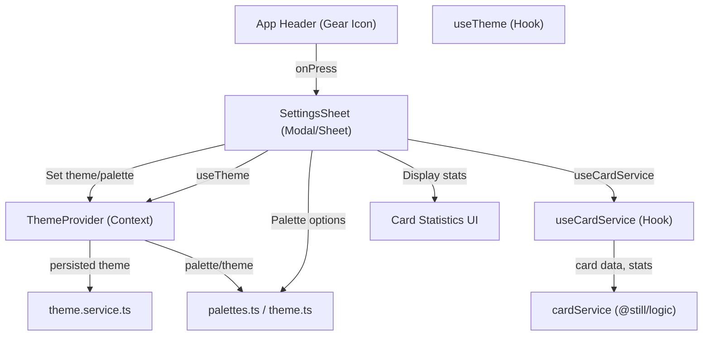

# Settings Screen Architecture

## Overview

The Settings Screen is a modular, extensible component that slides up as a sheet from the bottom of the mobile app when the user taps the gear icon in the header. It allows users to:
- Set theme preferences (dark/light/system)
- Choose from predefined color palettes
- View card statistics (count, review history, etc.)

All integration points leverage existing context providers and hooks, ensuring no direct service instantiation or hardcoded values.

---

## Component Diagram

---

## Data Flow: Theme Change

1. **User Action:** User selects a theme (dark/light/system) or palette in the SettingsSheet.
2. **State Update:** SettingsSheet calls `setTheme` or palette setter from `useTheme` (provided by ThemeProvider).
3. **Persistence:** ThemeProvider uses `theme.service.ts` to persist the selection (e.g., `saveThemeSelection`).
4. **Theme Application:** ThemeProvider updates context, triggering a re-render across the app with the new theme/palette.
5. **Palette Handling:** If a palette is selected, ThemeProvider (or a related context) uses utilities from `palettes.ts`/`theme.ts` to apply the palette.

**Extensibility:** New theme options or palettes can be added in `palettes.ts`/`theme.ts` without modifying the SettingsSheet logic.

---

## Data Flow: Card Statistics Retrieval

1. **Initialization:** SettingsSheet mounts and calls `useCardService()`.
2. **Data Fetch:** `useCardService` initializes and subscribes to `cardService` (from `@still/logic`), fetching all cards and updates.
3. **Statistics Calculation:** SettingsSheet computes statistics (e.g., count, review history) from the returned card data or via methods on `cardService`.
4. **Display:** CardStats UI component displays the statistics in the sheet.

**Extensibility:** Additional statistics or card metrics can be exposed via `cardService` and consumed by the CardStats component without changing the core architecture.

---

## Integration Points & Modular Boundaries

- **SettingsSheet**: Pure UI logic, consumes context/hooks only.
- **ThemeProvider/useTheme**: Centralized theme state and persistence, no direct access to storage from UI.
- **Palette Utilities**: All palette and theme logic is encapsulated in utility files.
- **CardServiceHook**: Abstracts card data and statistics, decoupling UI from data source.
- **No Hardcoded Values**: All options and data are sourced from context, hooks, or utility modules.

---

## Security & Best Practices

- No secrets or environment values are hardcoded.
- All state is managed via context/hooks for testability and extensibility.
- Modular boundaries ensure future features (e.g., notification settings) can be added with minimal changes.

---